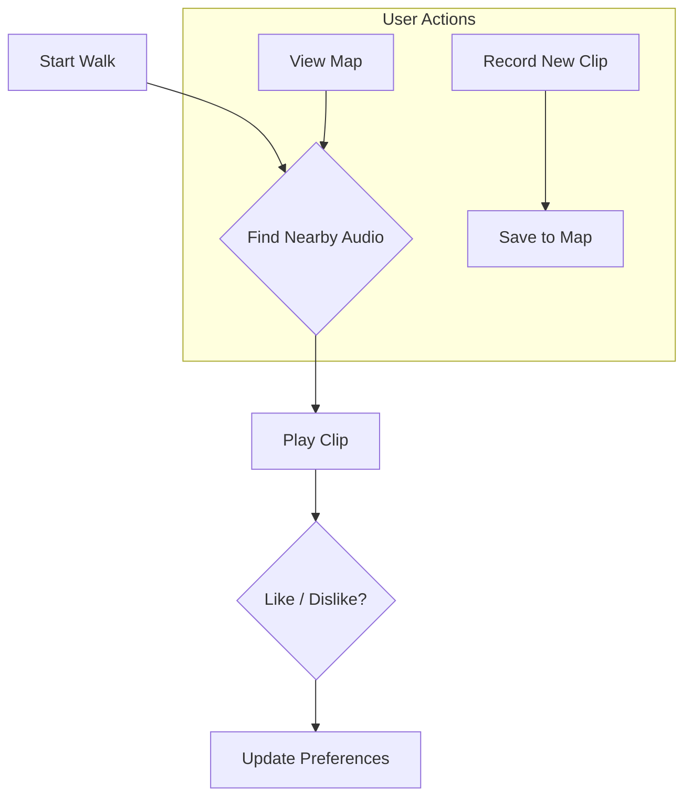

# SoundMap

A simple audio experience for exploring a city.

---

## About

SoundMap is a small project for listening to audio clips based on your location. It's designed to be used while walking, with a focus on sound and exploration.

 

 

## How It Works

1.  **Start Walking**: Begin a session to find nearby sounds.
2.  **Listen**: Audio clips play automatically when you enter a zone.
3.  **Explore**: Use the map to see where sounds are located.
4.  **Contribute**: Record your own clips to add to the map.

---

This project is for personal use and experimentation.
